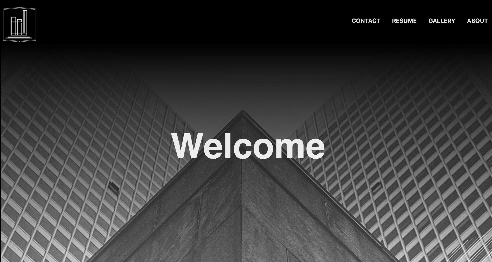

# Moore Engineering

### _A primarily front-end website featuring HTML, CSS and JavaScript to demo a Structural Engineering Firm._

---

## Table of Contents

- [Description](#Description)

- [Media](#Media)

- [User Story](#user-story)

- [Acceptance Criteria](#acceptance-criteria)

- [Deployed Site](#deployed-site)

- [Features](#Features)

- [Contributors](#Contributors)

- [Contact](#Contact)

- [Project Status](#project-status)

- [License](#License)

---

## Description
    This is a website for my incredible husband, David Moore, who is a Licensed Professional Engineer, (P.E.) in Houston, Texas.

    While my husband is not an entrepreneur, I decided to create a fun, mock-up website in his honor to gain some practice with front-end development. 
    
    I've created the logo for this site and played with typography and corporate fonts which I very much enjoyed. We do not claim rights to any of the photos and work shown does not reflect buildings engineered by David Moore.
    
    Enjoy!  

    Technologies include:  
    HTML, CSS, Javascript.

## Media

## User Story

    AS A top talent in civil, structural engineering   
    I WANT employers to visit a one-stop-shop website 
    SO THAT I can showcase my resume, portfolio and contact information

## Acceptance Criteria

    GIVEN that a user has accessed the website
    WHEN the user views the homepage
    THEN they are presented with a functional navigation bar

    GIVEN that a user selects *About*
    THEN the user is presented with the team of employees that make up the company

    GIVEN that a user selects *Resume*
    THEN the user is presented with David Moore's Resume

    GIVEN that a user selects *Gallery*
    THEN the user is presented with buildings the company has engineered.*

    GIVEN that a user selects *Contact*
    THEN the user is presented with a form to submit their contact information

    GIVEN that a user selects *The Logo*
    THEN the user is returns back to the homepage

## Deployed Site

    This website can be accessed here:

    https://celestealexmoore.github.io/moore_engineering/

## Features
    - Single-page application
    - Responsive CSS to adapt to mobile devices
    - Functioning contact form that sends e-mails once submitted

## Contributors

This website was created by Celeste Moore.

## Contact

If you have any questions about this repository, contact celestealexmoore via GitHub or reach out via email:
celestealexmoore@gmail.com.

## Project Status

In Progress

---

## License

© 2021 _celestealexmoore_